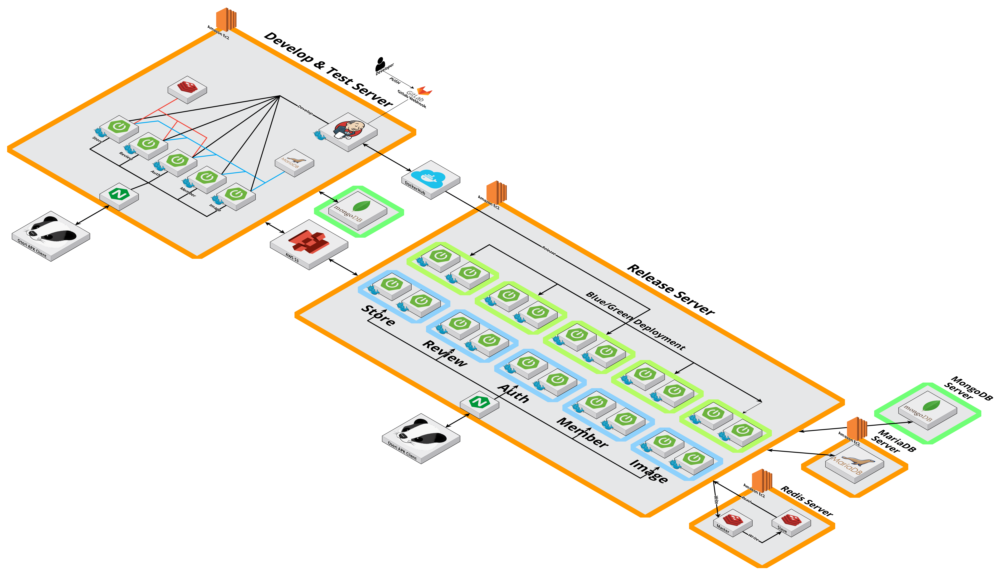
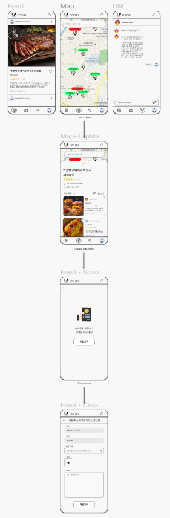
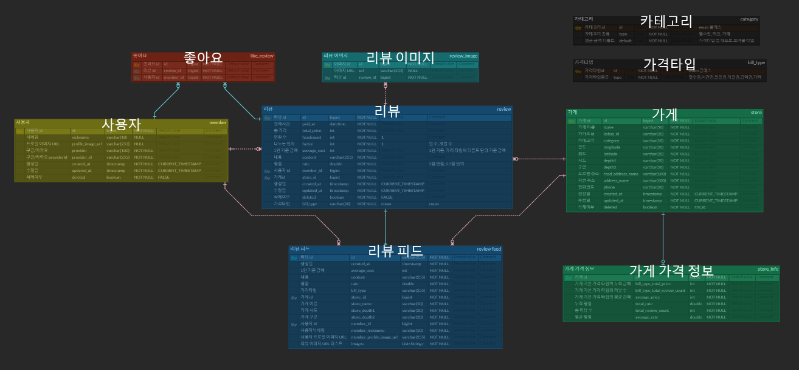
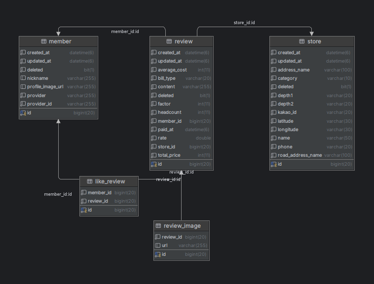
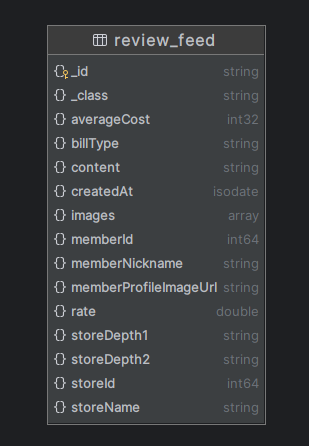
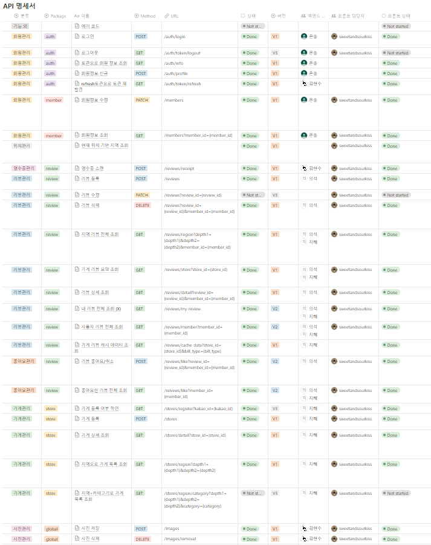

# 🦡 오소리


### <div align="center">
   오늘의 소비 리스트 | <b>오소리</b>
</div>

<br/>

<div align="center">
   소비 내역 기반 SNS
</div>

<br><br>

# 🔎 서비스 소개 Introduction

<b>오소리</b>는 온라인으로 가격 정보를 확인하기 힘든 가게의 정보를 다른 사람들의 리뷰를 통해 확인할 수 있는 서비스입니다.

영수증 인증 단계를 거친 신뢰할 수 있는 리뷰들을 통해 소통하고, 나만의 소비 피드를 만들어나가요!

<br><br>

# 👨‍👩‍👧‍👦 팀 Team


<br>

### 프로젝트 진행 기간

2023년 10월 9일 ~ 2023년 11월 17일 (6주)

<br><br>

# 🔧 기술스택 Tech Stack

### Server

```
AWS                       Ubuntu 20.04 LTS
Docker                    24.0.6
docker-compose            2.16.0
Nginx                     1.18.0
jenkins                   2.414.3
terraform                 1.6.3
```


### Database

```
MariaDB                   15.1
MongoDB                   5.0.21
Redis                     5.0.7
```


### Frontend

```
Dart                      3.1.5
Flutter                   3.13.9
```


### Backend

```
JAVA                      17.0.8
Spring Boot               3.1.4
gradle                    8.2.1
Spring Security           6.1.5
Spring Data JPA           3.1.3
Spring Cloud              2022.0.4
```


### API

```
Kakao Login API
Google Login API
Kakao Map API
Kakao Local API
Azure AI Document Intelligence Studio
```


<br><br>

# 💡 핵심 기능 Core Features

### 소비 내역 리뷰 피드

리뷰 피드를 통해 내 근처 사람들이 최근에 어떤 가게를 이용했는지 확인해요.

후기 사진을 통해 다른 사람들이 가게에서 어떤 활동을 했는지 알 수 있어요.

소비 금액을 통해 가게에서 1인 기준 얼마의 금액을 소비했는지 알 수 있어요.

리뷰에 '좋아요'를 등록해서 내가 좋아하는 리뷰에 추가할 수 있어요.

<br>

### 위치기반 가게 정보 조회

지도에서 현재 나의 위치를 기준으로 근처 가게들의 정보를 확인해요.

사람들이 해당 가게에서 평균적으로 얼마의 금액을 소비했는지 알 수 있어요.

사람들이 해당 가게에 평균적으로 몇 점의 평점을 남겼는지 알 수 있어요.

지도에서 한 눈에 가게들의 정보를 비교해요.

<br><br>

# 🎞️ 서비스 시연 Service Preview

### 로그인

카카오, 구글을 통한 간편 로그인을 지원하고 있어요.

<br>

### 리뷰 피드

내 근처 사람들이 최근에 작성한 리뷰를 확인할 수 있어요.

근처의 어떤 가게에서 얼마를 사용했고, 어떤 소비를 했는지 확인해봐요.

다른 사용자의 리뷰들이 궁금하다면 사용자 프로필을 클릭해서 확인해봐요.

가게 정보가 궁금하다면 가게를 클릭해서 확인해봐요.

리뷰가 마음에 든다면, '좋아요'를 눌러서 내가 좋아하는 리뷰에 저장해요.

<br>

### 가게 지도

지도에서 현재 나의 위치를 기준으로 근처 가게들의 정보를 확인해요.

사람들이 어떤 가게에서 평균적으로 얼마의 금액을 소비하고, 몇 점의 평점을 남겼는지 한 눈에 비교할 수 있어요.

마음에 드는 가게를 발견했다면 핀을 클릭해서 가게 상세 정보를 확인해요.

<br>

### 가게 상세 정보 확인

가게의 상세 정보를 확인해요.

가게의 이름, 주소, 연락처 등 기본적인 정보부터 평균 소비 금액과 평균 평점까지 확인할 수 있어요.

해당 가게에 남겨진 리뷰들을 간단하게 모아볼 수 있어요.

더 자세한 리뷰를 확인하고 싶다면 리뷰를 클릭해봐요.

<br>

### 리뷰 등록

새로운 소비를 했다면 리뷰를 등록해봐요.

내가 소비한 가게는 검색을 통해 간편하게 찾을 수 있어요.

가게를 선택하고, 영수증을 촬영해서 인증해요.

영수증 분석이 완료되면 소비 금액과 날짜가 정확하게 분석되었는지 확인해요.

몇 명의 친구들과 함께한 소비인지, 어떤 타입, 어떤 내용의 소비를 했는지 리뷰를 작성하고, 소비 내역에 대한 사진을 함께 기록해요.

<br>

### 마이페이지

내가 작성한 리뷰와 내가 좋아요한 리뷰를 모아볼 수 있어요.

나만의 소비 피드를 만들어 나갈 수 있어요.

다른 사람이 작성한 리뷰가 궁금하다면 다른 사람의 프로필을 구경해봐요.


<br><br>

# ⚙️ 시스템 아키텍처 System Architecture



<br><br>

# 📱 와이어프레임 Wireframe



<br><br>

# 💻 데이터베이스 구조 ERD



|MariaDB ERD|MongoDB ERD|
|---|---|
|||

<br><br>

# 📨 API 명세서 API Specification




